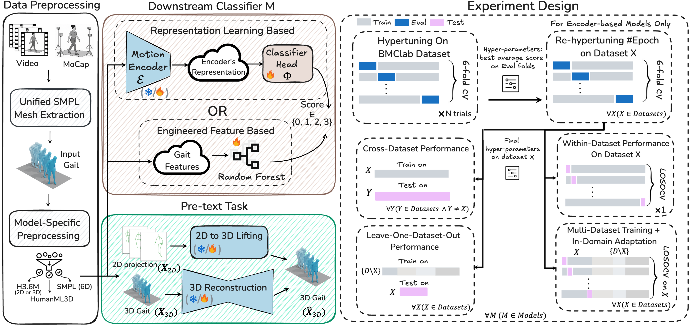

# CARE-PD
CARE-PD is a benchmark dataset and evaluation suite for clinical gait analysis in Parkinson’s Disease, released as part of NeurIPS 2025 Datasets & Benchmarks Track submission.



*Figure: Overview of the CARE-PD pipeline.*

## ⚙️ Get You Ready


```
git clone https://github.com/TaatiTeam/CARE-PD.git
cd CARE-PD
```
### 1️⃣ Install Dependencies

<!-- #### 🔹 Option 1: Install Using Conda (Recommended)
```
conda env create -n archgait -f environment.yml
conda activate archgait
``` -->

We tested our code on Python 3.9.21 and PyTorch 2.6.0

#### 🔹 Install Using Pip
```
python -m venv carepd
source carepd/bin/activate
pip install --upgrade pip
pip install -r requirements.txt
pip install torch==2.6.0+cu118 torchvision==0.21.0+cu118 --index-url https://download.pytorch.org/whl/cu118
```


### 2️⃣ Datasets setup
```
mkdir -p assets/datasets
```
Download the CARE-PD datasets from Dataverse and put them in the `assets/datasets` folder.

#### Preprocess Data
##### 🔹 h36m formats
<details>

Download preprocessed h36m formats from Dataverse  and put them in the `assets/datasets` folder.
Rename the folder:
```
mv assets/datasets/h36m_preprocessed assets/datasets/h36m
```
You can also preprocess all datasets with the following command but it might take quite some time:
```
bash scripts/preprocess_smpl2h36m.sh
```

</details>

##### 🔹 HumanML3D formats
<details>

Download preprocessed HumanML3D formats from Dataverse  and put them in the `assets/datasets` folder.
Rename the folder:
```
mv assets/datasets/HumanML3D_preprocessed assets/datasets/HumanML3D
```
You can also preprocess all datasets with the following command but it might take quite some time:
```
bash scripts/preprocess_smpl2humanml3d.sh
```
</details>

##### 🔹 6D rotation formats
<details>

Download preprocessed 6D rotation formats from Dataverse  and put them in the `assets/datasets` folder.
Rename the folder:
```
mv assets/datasets/6D_preprocessed assets/datasets/6D_SMPL
```
You can also preprocess all datasets with the following command but it might take quite some time:
```
bash scripts/preprocess_smpl2sixD.sh
```

</details>

Please also check [dataset.md](docs/dataset.md) for more information.

### 3️⃣ Models and Dependencies

#### Download Pre-trained Models
```
bash scripts/download_models.sh
```
Pretrained checkpoints will be downloaded in `assets/Pretrained_checkpoints`


## 🚀 Running code


### 🔍 Hyperparameter Tuning

<details>

You can run hyperparameter tuning on the **BMCLab** dataset across all backbone models using:

```
bash scripts/hypertune_all_models.sh
```

You can also run a single tuning job manually like this:

```
python eval_encoder_hypertune.py \
  --backbone MODELNAME \
  --config CONFIGNAME.json \
  --hypertune 1 \
  --tune_fresh 1 \
  --this_run_num 0 \
  --ntrials 50
```

#### 🧪 Tune Epochs on Other Datasets
After hypertuning on BMCLab, you can tune only the number of epochs for each remaining dataset using:

```
bash scripts/hypertune_epochs_all_datasets.sh
```

You can also run a single dataset tuning job like:

```
python run.py \
  --backbone MODELNAME \
  --config CONFIGNAME.json \
  --hypertune 1 \
  --tune_fresh 1 \
  --ntrials 5 \
  --this_run_num 0
```
</details>

### 📊 Train and Evaluation

<details>

#### 🧪 Within-Dataset Evaluation (LOSO)
You can run final Within-Dataset evaluation on each dataset using:

```
bash scripts/eval_within_dataset.sh
```
This script:

 - Loads the best hyperparameters from each study
 - Retrains the model from scratch on the full training folds
 - Evaluates performance in a LOSO setup
 - Automatically combines predictions from back and side views (for multi-view models)
 - Logs results and confusion matrices to `reports/intra_eval/`

You can also run a single dataset evaluation using:

##### 🔹 For single-view (3D) models:

```
python run.py \
  --backbone MODELNAME \
  --config CONFIGNAME.json \
  --hypertune 0 \
  --cross_dataset_test 0 \
  --this_run_num 0 \
  --num_folds -1
```
MODELNAME in (potr, momask, motionclip).

##### 🔹 For two-view 2D-to-3D models (combined views):

```
python run.py \
  --backbone MODELNAME \
  --hypertune 0 \
  --cross_dataset_test 0 \
  --this_run_num 0 \
  --num_folds -1 \
  --combine_views_preds 1 \
  --prefer_right 1 \
  --views_path \
    "Hypertune/MODELNAME_CONFIGNAME_backright/0" \
    "Hypertune/MODELNAME_CONFIGNAME_sideright/0"
```
MODELNAME in (motionbert, mixste, poseformerv2, motionagformer).

### 🌍 Cross-Dataset Evaluation

After within-dataset testing, you can evaluate how well each model generalizes across datasets.

To run all cross-dataset experiments:

```
bash scripts/eval_cross_dataset.sh
```

This script:

  - Loads the best hyperparameters from each model's tuning run
  - Trains each model on its original dataset
  - Tests on all other datasets (automatically handled in code)
  - Combines predictions from multiple views for multi-view models
  - Logs all outputs to reports/cross_eval/


To evaluate on a single model and dataset use:

##### 🔹 For single-view (3D) models:
```
python run.py \
  --backbone MODELNAME \
  --config CONFIGNAME.json \
  --hypertune 0 \
  --cross_dataset_test 1 \
  --this_run_num 0
```
MODELNAME in (potr, momask, motionclip).

##### 🔹 For two-view 2D-to-3D models (combined views):

```
python run.py \
  --backbone MODELNAME \
  --hypertune 0 \
  --cross_dataset_test 1 \
  --combine_views_preds 1 \
  --prefer_right 1 \
  --views_path \
    "Hypertune/MODELNAME_CONFIGNAME_backright/0" \
    "Hypertune/MODELNAME_CONFIGNAME_sideright/0"
```
MODELNAME in (motionbert, mixste, poseformerv2, motionagformer).

</details>